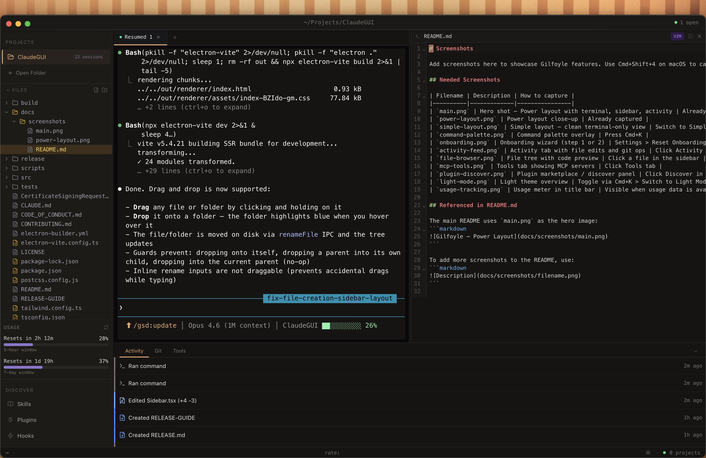
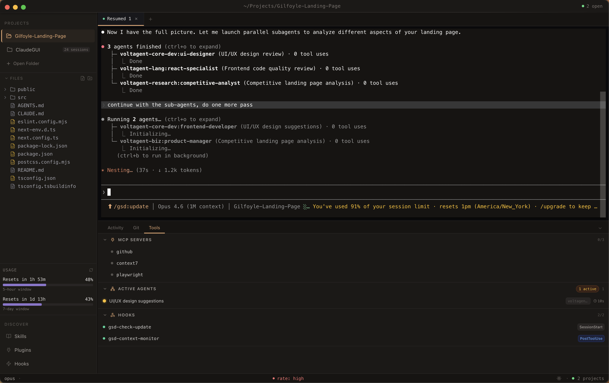
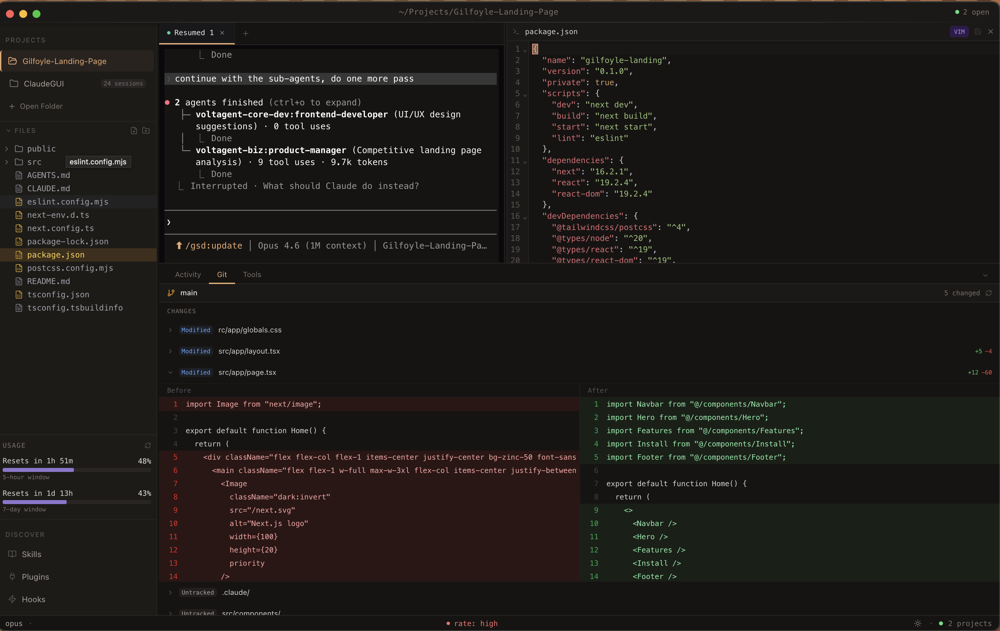
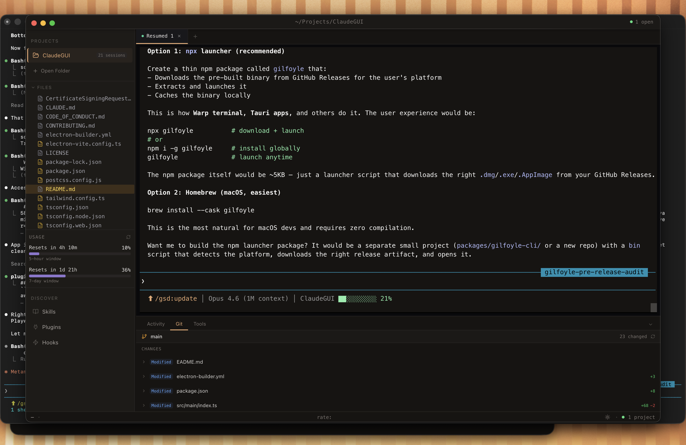

# Gilfoyle

A desktop environment for Claude Code.

[](https://opensource.org/licenses/MIT)
[](https://github.com/AadityaMishra1/Gilfoyle/releases)
[](https://github.com/AadityaMishra1/Gilfoyle/releases)



## Why Gilfoyle?

- **Full PTY terminal** — Not an API wrapper. Spawns the real `claude` process. Every Claude Code feature works exactly as it does in your terminal.
- **Multi-tab sessions** — Multiple terminals per project with session resume via `--resume`.
- **Visual dashboard** — Activity feed tracking file edits, git operations, tests, shell commands, agent spawns, and errors. Real-time MCP monitoring and plugin discovery.
- **All projects in one place** — Automatic discovery from `~/.claude/projects/` with file browsing, code preview, and Claude-modified file highlighting.

## Screenshots

<table>
<tr>
<td width="50%">


*Active agents running in parallel with MCP servers and hooks*

</td>
<td width="50%">


*Git changes with inline diffs and side-by-side code editor*

</td>
</tr>
<tr>
<td width="50%">


*Power layout with git panel, file tree, and usage tracking*

</td>
<td width="50%">


*Activity feed, file explorer, and multi-project sidebar*

</td>
</tr>
</table>

## Features

- Multi-tab terminal sessions with session resume
- Project-scoped active agent tracking
- Project discovery from `~/.claude/projects/`
- Activity feed (file edits, git ops, tests, shell commands, agent spawns, errors)
- Git panel with branch info, changes, and inline diffs
- File browser with code preview and syntax highlighting
- MCP server monitoring with tool counts
- Plugin marketplace (curated registry + GitHub discovery)
- Usage tracking (real subscription percentages via OAuth)
- Command palette (Cmd/Ctrl+K)
- Two layouts: Simple (terminal-focused) or Power (multi-panel dashboard)
- Dark/light theme with warm dark default
- Cross-platform: macOS, Windows, Linux
- Auto-updates via GitHub Releases

## Install

Download the latest release for your platform from [GitHub Releases](https://github.com/AadityaMishra1/Gilfoyle/releases):

| Platform | Format | Download |
|----------|--------|----------|
| macOS (Homebrew) | `brew install --cask gilfoyle` | [Tap](https://github.com/AadityaMishra1/homebrew-gilfoyle) |
| macOS | `.dmg` (universal) | [Releases](https://github.com/AadityaMishra1/Gilfoyle/releases) |
| Windows | `.exe` installer | [Releases](https://github.com/AadityaMishra1/Gilfoyle/releases) |
| Linux | `.AppImage` or `.deb` | [Releases](https://github.com/AadityaMishra1/Gilfoyle/releases) |

### Homebrew (macOS)

```bash
brew tap AadityaMishra1/gilfoyle
brew install --cask gilfoyle
```

### Prerequisites

- **Claude Code CLI** — Install with `npm i -g @anthropic-ai/claude-code`. Verify with `which claude`.
- **A Claude account** — Pro, Max, Teams, or API access required.

### macOS: First Launch

macOS will show "cannot verify the developer" on first open. To bypass this:

1. **Right-click** (or Control-click) the app in Finder
2. Click **Open**
3. Click **Open** again in the dialog

You only need to do this once. Alternatively, run:

```bash
xattr -cr /Applications/Gilfoyle.app
```

## Build from Source

```bash
git clone https://github.com/AadityaMishra1/Gilfoyle.git
cd Gilfoyle
npm install
npm run build
npm run package:mac   # or package:win or package:linux
```

**Requirements:**
- Node.js 20+
- Python 3
- C++ build tools (for node-pty native module)

## Development

```bash
npm run dev          # dev server with HMR
npm run build        # production build
npm run typecheck    # type checking
npm run lint         # linting
npm run test         # run tests
```

## Troubleshooting

**"Cannot verify the developer" on macOS**

Right-click the app and select Open, or run:
```bash
xattr -cr /Applications/Gilfoyle.app
```

**Claude Code not found**

Ensure `claude` is in your PATH. Verify with:
```bash
which claude
```

If not found, install with:
```bash
npm i -g @anthropic-ai/claude-code
```

**node-pty build failures**

Ensure Python 3 and C++ build tools are installed:

- **macOS**: Run `xcode-select --install`
- **Windows**: Run `npm install --global windows-build-tools`
- **Linux**: Run `sudo apt install build-essential`

**Blank or white screen on launch**

Try a clean build and relaunch:
```bash
rm -rf out && npm run build
```

## Contributing

See [CONTRIBUTING.md](CONTRIBUTING.md).

## License

MIT

if anyone at anthropic or any tech company sees this and needs interns let me know :)
